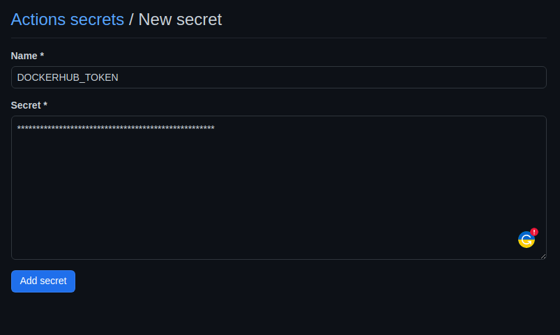

# Hello K8s

# Overview

This source code has a tutorial porpuse and we plan to create a multi node kubernetes cluster and deploy a sample react application. The react application will be deployed by a helm chart repository which will be created after a CI/CD piepline. This tutorial shows a continues deployment practice. After passing the pipeline a docker image alongside a helm chart will be delivered.  

## Content

- Create a Multinode Kind cluster with Ansible and install required CRDs

- Prepare the Infrastructure with CDKTF (Terraform + java)

- Deploy Argocd

- Create a Helm repository on github pages and push k8s-hello react app as a helm package.
  
  


### Create the cluster

To make the cluster you can use the runer script `run.sh` in the root of the project.

```bash
$ ./run.sh 
██╗  ██╗███████╗██╗     ██╗      ██████╗       ██╗  ██╗ █████╗ ███████╗
██║  ██║██╔════╝██║     ██║     ██╔═══██╗      ██║ ██╔╝██╔══██╗██╔════╝
███████║█████╗  ██║     ██║     ██║   ██║█████╗█████╔╝ ╚█████╔╝███████╗
██╔══██║██╔══╝  ██║     ██║     ██║   ██║╚════╝██╔═██╗ ██╔══██╗╚════██║
██║  ██║███████╗███████╗███████╗╚██████╔╝      ██║  ██╗╚█████╔╝███████║
╚═╝  ╚═╝╚══════╝╚══════╝╚══════╝ ╚═════╝       ╚═╝  ╚═╝ ╚════╝ ╚══════╝
                                                                       
My First Menu
1) Create a kubernetes cluster
2) Delete kubernetes cluster
3) deploy infrastructure
Choose an option: 1

how many master nodes you want to have? (default is 1)
write a number: 2

how many worker nodes you want to have? (default is 0)
write a number: 2
master nodes: 2
worker nodes: 2
Creating kind cluster... 🙃
```

```bash
#!/bin/bash
#====================================================================================================================================================
server_name=$(hostname)
masterNodes=1
workerNodes=0
function chooseNodesNumber(){
    echo -ne "
how many master nodes you want to have? (default is 1)
$(ColorBlue 'write a number:') "
        read a
        masterNodes=$a
    echo -ne "
how many worker nodes you want to have? (default is 0)
$(ColorBlue 'write a number:') "
        read b
        workerNodes=$b

}
function create_cluster() {
    chooseNodesNumber
    echo "master nodes: $masterNodes"
    echo "worker nodes: $workerNodes"
    echo "Createing kind cluster... 🙃"
    ansible-playbook ansible/kind.yml -i hosts --tags "create" -e "HOSTS=localhost control_nodes=$masterNodes worker_nodes=$workerNodes cluster_name=k8s-hello" -u thedatabaseme -k -K
    echo "Cluster k8s-learn with 1 control-plan and two worket nodes created 🙂"
     
}

#====================================================================================================================================================
function delete_cluster() {
	echo "Deleteing the kind cluster... 🙁"
    kind delete cluster --name=k8s-hello
    echo "Cluster k8s-learn deleted 🙁"
}
#====================================================================================================================================================
function deploy_infrastructure() {
    echo "prepareing the infrastructure... 🧐"
    echo "Synthesizing... 😎"
    cd k8s-infrastructure && cdktf get && cdktf synth
    cd ..
    echo "terraform code generated 😀"
    cd k8s-infrastructure/cdktf.out/stacks/k8s-infrastructure &&
    # uncomment if this is the first time you want to plan the terraform
    #.............................
    #echo "initializing terraform..."
    #terraform init
    #echo "terraform initialized"
    # echo "planning terraform..."
    # terraform plan --out plan
    #.............................
    echo "terraform planned"
    terraform apply
    echo "infrstructure is ready"

}
#====================================================================================================================================================
##
# Color  Variables
##
green='\e[32m'
blue='\e[34m'
clear='\e[0m'
##
# Color Functions
##
ColorGreen(){
	echo -ne $green$1$clear
}
ColorBlue(){
	echo -ne $blue$1$clear
}
#====================================================================================================================================================
menu(){
echo "
██╗  ██╗███████╗██╗     ██╗      ██████╗       ██╗  ██╗ █████╗ ███████╗
██║  ██║██╔════╝██║     ██║     ██╔═══██╗      ██║ ██╔╝██╔══██╗██╔════╝
███████║█████╗  ██║     ██║     ██║   ██║█████╗█████╔╝ ╚█████╔╝███████╗
██╔══██║██╔══╝  ██║     ██║     ██║   ██║╚════╝██╔═██╗ ██╔══██╗╚════██║
██║  ██║███████╗███████╗███████╗╚██████╔╝      ██║  ██╗╚█████╔╝███████║
╚═╝  ╚═╝╚══════╝╚══════╝╚══════╝ ╚═════╝       ╚═╝  ╚═╝ ╚════╝ ╚══════╝
                                                                       "

echo -ne "
My First Menu
$(ColorGreen '1)') Create a kubernetes cluster
$(ColorGreen '2)') Delete kubernetes cluster
$(ColorGreen '3)') deploy infrastructure
$(ColorBlue 'Choose an option:') "
        read a
        case $a in
	        1) create_cluster ;;
            2) delete_cluster ;;
	        3) deploy_infrastructure ;;
		0) exit 0 ;;
		*) echo -e $red"Wrong option."$clear; WrongCommand;;
        esac
}
# Call the menu function
menu
#====================================================================================================================================================
```

## Configuration Management

We conduct the configuration management with ansible. Ansible code has a single task called `create-cluster` with the following tasks.

- precheck

- install

- create-cluster

- delete-cluster

- main

#### precheck

Precheck part checks the availablity of some packages and also collecting some OS facts.

precheck.yml

```yaml
---

- name: Check if OS distribution is some Debian kind
  fail:
    msg: "OS distribution {{ ansible_os_family }} is not Debian family!"
  when: (not ansible_os_family == 'Debian')
  tags:
    - precheck

- name: Check if kind already installed into {{ kind_install_dir }}
  stat:
    path: "{{ kind_install_dir }}/kind"
  register: kind_status
  tags:
    - always

- name: Kind is not installed
  fail:
    msg: "Kind is not installed under the specified location {{ kind_install_dir }}/kind!"
  when: not kind_status.stat.exists
  tags:
    - create
    - delete

- name: Check installed kind version
  shell: "{{ kind_install_dir }}/kind --version | awk -F ' ' '{print \"v\"$3}'"
  changed_when: false
  register: kind_installed_version

  tags:
    - always

- name: Get latest kind release
  uri:
    url: "{{ kind_git }}/releases/latest"
    return_content: true
    body_format: json
  register: kind_latest_release
  when: kind_version == 'latest'
  tags:
    - precheck

- name: Set version to install
  set_fact:
    kind_version: "{{ kind_latest_release.json.tag_name }}"
  when: kind_version == 'latest'
  tags:
    - precheck

- name: Installation will be skipped
  debug:
    msg: "Installation will be skipped, the version {{ kind_version }} specified is already installed!"
  when: kind_version == kind_installed_version.stdout
  tags:
    - precheck

- name: "Check If kubectl is installed"
  stat:
    path: "/usr/local/bin/kubectl"
  register: kubectl_state
  tags:
    - precheck
```

#### Install

Install task tries to install necessary packages based on the states that we collected during the prechecking.

install.yml

```yaml
---

- name: Download kind to specified location {{ kind_install_dir }}
  get_url:
    url: "{{ kind_repo }}"
    dest: "{{ kind_install_dir }}/kind"
    mode: 0755
    force: true
  become: true
  tags:
    - install


- name: Installation has been finished
  debug:
    msg: "Installation of kind version {{ kind_version }} has been finished!"
  tags:
    - install

- name: "install kubectl"
  shell: curl -LO https://storage.googleapis.com/kubernetes-release/release/`curl -s https://storage.googleapis.com/kubernetes-release/release/stable.txt`/bin/linux/amd64/kubectl
  when: not kubectl_state.stat.exists
  tags:
    - install

- name: "change kubectl permission"
  shell: chmod +x kubectl
  become: yes
  when: not kubectl_state.stat.exists
  tags:
    - install

    
- name: "move kubectl "
  shell: mv kubectl /usr/local/bin/
  become: yes
  when: not kubectl_state.stat.exists
  tags:
    - install
```

#### Create Cluster

Create cluster task uses kind cli tool to create the cluster based on the `kube-config` file.

create-cluster.yml

```yaml
---


- name: Copy cluster config template
  template:
    src: "{{ role_path }}/templates/cluster-config.yaml.j2"
    dest: "/tmp/cluster-config.yaml"
    mode: 0644
  tags:
    - create

- name: Create kind cluster
  shell: "kind create cluster --name {{ cluster_name }} --config /tmp/cluster-config.yaml"
  tags:
   - create

- name: Cluster creation has been finished
  debug:
    msg: "Cluster creation of kind cluster {{ cluster_name }} has been finished."
  tags:
    - create

- name: install argocd application crde
  shell: kubectl apply -n argocd -f https://raw.githubusercontent.com/argoproj/argo-cd/master/manifests/crds/application-crd.yaml
  tags:
    - create


```

#### Delete cluster

delete-cluster.yml task deletes the cluster a cluster is available.

delete-cluster.yml

```yaml
---

- name: Check if cluster {{ cluster_name }} is running
  shell: "kind get clusters | grep -w {{ cluster_name }}"
  failed_when: false
  register: cluster_list
  tags:
    - delete

- name: Cluster {{ cluster_name }} does not exist
  fail:
    msg: "Cluster {{ cluster_name }} seems not to be running on this system."
  when: cluster_list.stdout | length == 0
  tags:
    - delete

- name: Delete kind cluster {{ cluster_name }}
  shell: "kind delete cluster --name {{ cluster_name }}"
  tags:
    - delete
```

---

## Infrastructure

After creating the cluster you can deploy the infrastructure. 

Infrastructure contains some sample applications:

- kube-prometheus

- Elastic search

- Nginx-ingress-controller

- Argocd

- mongodb

Infrastructure has been written in java with CDKTF (Cloud Development Kit Terraform). It consists of a stack package.

below you can have a snpashot of the Stack class.


This is an interface that defines the sigunature of deployment methods. Any class that needs to deploy 

IInfrastructure.java

```java
package com.mycompany.app.stacks;

import software.constructs.Construct;

import java.util.HashMap;
import java.util.List;
import java.util.Map;

public interface IInfrastructure {
    String elasticSearchDeploy(String name,String version, List<String> vars);
    String nginxIngressControllerDeploy(String name,String version, List<String> vars);
    String argocdDeploy(String name,String version, List<String> vars);
    String prometheus(String name,String version,List<String> vars);
    String mongodbDeploy(String name,Map<String,Object> manifest);
}

```

In the following code you can an implementation of this interface called webapp that defines the method bodies.

WebappInfrastructure.java

```java
package com.mycompany.app.stacks.webapp;

import com.mycompany.app.stacks.IInfrastructure;
import imports.helm.*;
import imports.kubernetes.Manifest;
import imports.kubernetes.ManifestConfig;
import software.constructs.Construct;

import java.util.*;


public class WebappInfrastructure implements IInfrastructure {

    private HelmProvider helm;
    Construct construct;
    String name;
    Release argocdRelease;

    public HelmProvider getHelm() {
        return helm;
    }

    public void setHelm(HelmProvider helm) {
        this.helm = helm;
    }

    public Construct getConstruct() {
        return construct;
    }

    public void setConstruct(Construct construct) {
        this.construct = construct;
    }

    public String getName() {
        return name;
    }

    public void setName(String name) {
        this.name = name;
    }

    public WebappInfrastructure(Construct construct, String name){
        this.setConstruct(construct);
        this.setName(name);

        helm=new HelmProvider(this.construct,this.name, HelmProviderConfig.builder().kubernetes(HelmProviderKubernetes.builder().configPath("~/.kube/config").build()).build());
    }

    @Override
    public String elasticSearchDeploy(String name,String version, List<String> vars) {
        new Release(construct,name, ReleaseConfig.builder().chart("elasticsearch").version(version).repository("https://charts.bitnami.com/bitnami").name(name).values(vars).build());
        return null;
    }

    @Override
    public String nginxIngressControllerDeploy(String name,String version, List<String> vars) {
        new Release(construct,name, ReleaseConfig.builder().chart("nginx-ingress-controller").version(version).repository("https://charts.bitnami.com/bitnami").values(vars).name(name).build());
        return null;
    }

    @Override
    public String argocdDeploy(String name, String version, List<String> vars) {
        this.argocdRelease=new Release(construct,name, ReleaseConfig.builder().chart("argo-cd").version(version).repository("https://charts.bitnami.com/bitnami").values(vars).name(name).build());
        return null;
    }

    @Override
    public String prometheus(String name, String version, List<String> vars) {

        new Release(construct,name, ReleaseConfig.builder().chart("kube-prometheus").version(version).repository("https://charts.bitnami.com/bitnami").values(vars).name(name).build());
        return null;
    }

    @Override
    public String mongodbDeploy(String name,Map<String, Object> manifest) {
        List<Release> dependencies=new ArrayList<>();
        dependencies.add(this.argocdRelease);
        new Manifest(construct,name,ManifestConfig.builder().manifest(manifest).dependsOn(dependencies).build());
        return null;
    }

}

```

MainStackClass is responsible to make an instantiation of the WebappInfrastructure class and dills the necessary information.

MainStack.java

```java
package com.mycompany.app;

import com.google.gson.Gson;
import com.google.gson.stream.JsonReader;
import com.mycompany.app.stacks.webapp.WebappInfrastructure;
import imports.kubernetes.KubernetesProvider;
import imports.kubernetes.KubernetesProviderConfig;
import software.constructs.Construct;
import com.hashicorp.cdktf.TerraformStack;

import java.io.FileNotFoundException;
import java.io.FileReader;
import java.util.*;

public class MainStack extends TerraformStack
{
    public MainStack(final Construct scope, final String id) throws FileNotFoundException {
        super(scope, id);
        List<String> elasticValues=new ArrayList<>();
        elasticValues.add("values.master.replicaCount: 1");
        elasticValues.add("data.replicaCount: 1");
        elasticValues.add("ingest.replicaCount: 1");
        elasticValues.add("coordinating.replicaCount: 1");
        JsonReader reader = new JsonReader(new FileReader("src/main/java/com/mycompany/app/applications/intersectionOverunion.json"));
        Map mongomanifest = new Gson().fromJson(reader, Map.class);
        new KubernetesProvider(this,"kubernetes", KubernetesProviderConfig.builder().configPath("~/.kube/config").build());
        WebappInfrastructure infrastructure=new WebappInfrastructure(this,"webapp");
        infrastructure.elasticSearchDeploy("elasticsearch","19.3.0", elasticValues);
        infrastructure.nginxIngressControllerDeploy("nginx-ingress-controller","9.3.8",null);
        infrastructure.argocdDeploy("argo-cd","4.3.1",null);
        infrastructure.mongodbDeploy("hello-k8s",mongomanifest);
        infrastructure.prometheus("kube-prometheus","8.1.11",null);
    }
}

```

The last part is the main class that is responsible to careate the actual stack and synthesize the java code to ja terraform code (json).

Main.java

```java
package com.mycompany.app;

import software.constructs.Construct;
import com.hashicorp.cdktf.App;
import com.hashicorp.cdktf.TerraformStack;
import java.io.FileNotFoundException;

public class Main
{
    public static void main(String[] args) throws FileNotFoundException {
        final App app = new App();
        new MainStack(app, "k8s-infrastructure");
        app.synth();
    }
}

```

For the contineus deployment we need to have a kubernetes manifest file that has `Application` as the resource kind (Argocd CRD).

webapp.json

```json
{
  "apiVersion": "argoproj.io/v1alpha1",
  "kind": "Application",
  "metadata": {
    "name": "hello-k8s",
    "namespace": "default"
  },
  "spec": {
    "destination": {
      "namespace": "default",
      "server": "https://kubernetes.default.svc"
    },
    "project": "default",
    "source": {
      "helm": {
        "parameters": null
      },
      "chart": "k8s-hello",
      "repoURL": "https://devopshobbies.github.io/k8s-hello-chart/",
      "targetRevision": "0.1.1"
    },
    "syncPolicy": {
      "automated": {
        "prune": true,
        "selfHeal": true
      },
      "syncOptions": [
        "CreateNamespace=true"
      ]
    }
  }
}

```

### CI/CD

In the following file you can see the github actions file

release.yml

```yaml
name: Release Charts
on:
  push:
    branches: [main]
jobs:
  release:
    runs-on: ubuntu-latest
    steps:
      - name: Checkout
        uses: actions/checkout@v1
      - name: Configure git
        run: |
           git config user.name "$GITHUB_ACTOR"
           git config user.email "$GITHUB_ACTOR@users.noreply.github.com"
      - name: Run chart-releaser
        uses: helm/chart-releaser-action@v1.0.0
        env:
          CR_TOKEN: "${{ secrets.GITHUB_TOKEN }}"
  docker:
    runs-on: ubuntu-latest
    steps:
      - name: Login to Docker Hub
        uses: docker/login-action@v2
        with:
          username: ${{ secrets.DOCKERHUB_USERNAME }}
          password: ${{ secrets.DOCKERHUB_TOKEN }}
      - name: Build and push
        uses: docker/build-push-action@v3
        with:
          push: true
          tags: moeidheidari/hello-k8s:latest
```

to make the cicd pipeline working you need to define two secrets in your github account.

- dockerhub username

- dockerhub token

**Github**

go to repository settings-> Secrets and variables - >actions-> new repository secret.



### Hello-k8s helm chart

```bash
helm repo add hello-k8s https://devopshobbies.github.io/k8s-hello-chart/
helm repo update
helm install hello-k8s hello-k8s/hello-k8s
```

#### Hello k8s fronend app

```bash
git clone https://github.com/devopshobbies/hello-k8s.git
```

#### Hello K8s Docker file

```bash
docker push moeidheidari/hello-k8s:latest
```